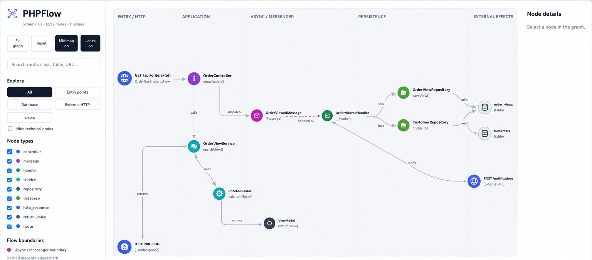

# PHPFlow

**Understand what your Symfony application can actually do — without running it.**

PHPFlow is an open-source static flow analyzer for PHP. It reconstructs application paths from
HTTP routes and Messenger messages through controllers, handlers, services and repositories,
all the way to database effects, external HTTP calls, responses and exceptions.

<p align="center">
  
</p>

> The graph above uses fictional domain names to keep the example application-neutral.
> PHPFlow's HTML viewer is self-contained and generated locally from the analyzed source.

## What can PHPFlow answer?

When a Symfony application grows, answering a simple question often means jumping through
controllers, service interfaces, Messenger configuration, handlers and repositories.

PHPFlow turns that investigation into queries you can repeat:

| Question | PHPFlow |
| --- | --- |
| **What happens when this route is called?** | Follow the flow from route to responses, effects and failures. |
| **Which entry points touch this table?** | Trace database impact backwards to HTTP routes and messages. |
| **What depends on this service?** | Find the reachable application flows before changing it. |
| **Where is this message handled?** | Follow Messenger dispatches, handlers and async boundaries. |
| **Which flows call this external API?** | Find statically recoverable HTTP dependencies and their callers. |
| **Where can this exception surface?** | Trace failures back to the entry points that can reach them. |

PHPFlow performs **static analysis only**. It does not boot or execute the target application.

## See the flow, not just the files

A flow such as:

```text
POST /catalog/{recordId}/sync
└── CatalogController::sync
    └── SyncRecord
        └── SyncRecordHandler::__invoke
            ├── RecordRepositoryInterface::findRequired
            │   └── RecordRepository::findRequired
            │       └── SELECT records
            ├── ExternalSyncClientInterface::sync
            │   └── POST %sync.base_url%/v1/resources
            └── RecordLinkRepositoryInterface::insert
                └── INSERT record_links
```

can be explored as an interactive graph with functional lanes, Messenger boundaries, search,
filters, minimap navigation, entry-path highlighting, paths to effects and critical-path focus.

The exact graph is deliberately conservative: PHPFlow only reports relationships it can prove
from supported static patterns.

## Quick start

PHPFlow's repository workflow uses Docker, so PHP does not need to be installed on the host.

```bash
git clone <repository-url>
cd phpflow
make build
docker compose run --rm php composer install
```

Analyze a project:

```bash
make scan PROJECT_PATH=/path/to/project
```

Inspect one HTTP flow:

```bash
make inspect \
    PROJECT_PATH=/path/to/project \
    ROUTE='/catalog/{recordId}/sync' \
    METHOD=POST
```

Generate the interactive viewer:

```bash
make export-html \
    PROJECT_PATH=/path/to/project \
    HTML_OUTPUT=/tmp/phpflow.html
```

Open `/tmp/phpflow.html` in a browser. The export is a self-contained HTML file with no external
JavaScript or CDN dependency.


### Try it on the bundled Symfony demo

PHPFlow ships with a synthetic Symfony application containing routes, Messenger flows, service
aliases, Doctrine/DBAL effects, external HTTP calls, exceptions and control-flow examples.

```bash
make demo-scan
make demo-html
```

Then open `/tmp/phpflow-demo.html`. The full scenario map is documented in
[`examples/symfony-demo/README.md`](examples/symfony-demo/README.md).

## Impact analysis

PHPFlow can traverse the graph in the opposite direction too: start with something you plan to
change and discover which entry points can reach it.

```bash
make impact PROJECT_PATH=/path/to/project TABLE=companies
make impact PROJECT_PATH=/path/to/project HTTP='/v2/directory/search'
make impact PROJECT_PATH=/path/to/project MESSAGE=SyncCompany
make impact PROJECT_PATH=/path/to/project SERVICE='InvoiceGenerator::generate'
make impact PROJECT_PATH=/path/to/project EXCEPTION=PaymentFailed
```

Use `SUMMARY=1` when you only need the impacted entry points:

```bash
make impact \
    PROJECT_PATH=/path/to/project \
    SERVICE='InvoiceGenerator::generate' \
    SUMMARY=1
```

Database impact can also be narrowed by operation:

```bash
make impact-table \
    PROJECT_PATH=/path/to/project \
    TABLE=companies \
    OPERATION=SELECT
```

## Explore interactively

The HTML viewer is designed for investigation rather than static diagrams. It includes:

- deterministic hierarchical layout and functional swimlanes;
- distinct async / Messenger boundaries;
- node-type and exploration filters;
- full-graph search across nodes and edge metadata;
- expand/collapse and focused branches;
- entry-point path highlighting;
- path-to-effects and critical-path highlighting;
- a minimap for large graphs;
- detailed node metadata including callable, FQCN and source file when available.

You can also scope an export to one route:

```bash
make export-html \
    PROJECT_PATH=/path/to/project \
    HTML_OUTPUT=/tmp/phpflow-route.html \
    ROUTE='/catalog/{recordId}/sync' \
    METHOD=POST
```

## Machine-readable output

PHPFlow exports versioned JSON for tooling and future CI integrations.

```bash
make export-json \
    PROJECT_PATH=/path/to/project \
    JSON_OUTPUT=/tmp/phpflow.json
```

Current public schemas:

| Output | Schema |
| --- | ---: |
| Graph JSON | `1.2` |
| Impact JSON | `1.0` |
| Graph diff JSON | `1.0` |

Compare two graph exports:

```bash
make diff \
    BEFORE=/path/before.json \
    AFTER=/path/after.json \
    FORMAT=json \
    OUTPUT=/tmp/phpflow-diff.json
```

A Mermaid exporter is also available for documentation-oriented diagrams.

## What PHPFlow understands today

PHPFlow v0.1 focuses on modern Symfony applications and currently understands, among other
patterns:

- PHP declarations, attributes and namespaced symbols;
- Symfony `#[Route]` controllers and HTTP responses;
- dependency-injected services and interface-to-implementation resolution;
- Symfony service aliases from supported PHP configuration;
- Messenger dispatches, handlers, routing and recursive message flows;
- repositories, Doctrine DBAL calls and QueryBuilder database effects;
- common `SELECT`, `INSERT`, `UPDATE` and `DELETE` table effects;
- external HTTP calls with statically recoverable methods and URLs;
- conditions, `match`, guards, loops, `try/catch/finally` and exceptions;
- recursive service/repository chains and cycle detection.

For the precise boundary between **supported**, **partial** and **not supported**, see the
[v0.1 support matrix](docs/SUPPORT.md).

> A missing edge means PHPFlow could not prove that relationship from the supported static
> patterns. It does not prove that the relationship can never happen at runtime.

## Why static?

PHPFlow is meant to help with codebases that are difficult to understand precisely because
their behavior is distributed across framework conventions and configuration.

Static analysis gives it a useful operating model:

- the target application is not executed;
- analysis can work without reproducing a full runtime scenario;
- results can be exported and compared;
- source-level architecture can be investigated before making a change.

This also makes PHPFlow suitable for sensitive or legacy projects where executing arbitrary
application code during analysis would be undesirable.

## Documentation

- [CLI contract](docs/CLI.md) — stable v0.1 commands, exit statuses and output schemas.
- [Support matrix](docs/SUPPORT.md) — what PHPFlow can and cannot prove today.
- [Contributing guide](CONTRIBUTING.md) — development workflow and reproducible static-pattern reports.
- [Security policy](SECURITY.md) — how to report security-sensitive behavior safely.
- [Code of conduct](CODE_OF_CONDUCT.md) — expectations for project participation.
- [Changelog](CHANGELOG.md) — release history.
- [Release checklist](RELEASE.md) — maintainer release procedure.

## Requirements

The recommended repository setup requires **Docker with Docker Compose** and **GNU Make**.
The PHP package itself requires **PHP 8.4**.

## Development

Install dependencies and run the suite:

```bash
make build
docker compose run --rm php composer install
make test
```

Verify the release contract:

```bash
make release-check
docker compose run --rm php composer validate --strict
docker compose run --rm php php bin/phpflow --version
```

PHPFlow is currently evolving around real-world Symfony applications. Reproducible examples of
unsupported static patterns are especially useful when reporting issues. See
[CONTRIBUTING.md](CONTRIBUTING.md) before proposing a change or attaching a reproduction.

## License

PHPFlow is released under the [MIT License](LICENSE).
